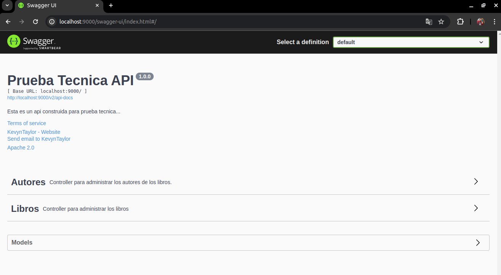

# Prueba Tecnica

## Ejecución
Para ejecutar el proyecto, sigue estos pasos:

Clona este repositorio en tu máquina local.
Asegúrate de tener Java y Maven instalados en tu sistema.
Abre una terminal y navega hasta el directorio raíz del proyecto.
Ejecuta el siguiente comando para compilar y ejecutar el proyecto:
bash
Copy code
mvn spring-boot:run
El proyecto se ejecutará en el puerto 9000.

## Documentación de Servicios
La documentación de los servicios RESTful se encuentra disponible a través de Swagger. Puedes acceder a la documentación utilizando el siguiente enlace:

Swagger - Documentación de Servicios

## Estructura del Proyecto
El proyecto sigue una arquitectura de capas con controladores, servicios y repositorios:

Capa de Controladores: Contiene las clases que manejan las solicitudes HTTP y gestionan las respuestas.
Capa de Servicios: Contiene las clases que encapsulan la lógica de negocio y coordinan las operaciones entre los controladores y los repositorios.
Capa de Repositorios: Contiene las interfaces que definen las operaciones de acceso a datos.
Base de Datos
Se utiliza una base de datos H2 en memoria. Las credenciales y configuraciones de la base de datos se encuentran en el archivo de propiedades (application.properties).

## Scripts
En el directorio scripts, encontrarás los scripts solicitados de consultas SQL y PL/SQL.

## Captura de Pantalla
A continuación, se muestra una captura de pantalla del acceso a Swagger, donde puedes probar el API:

